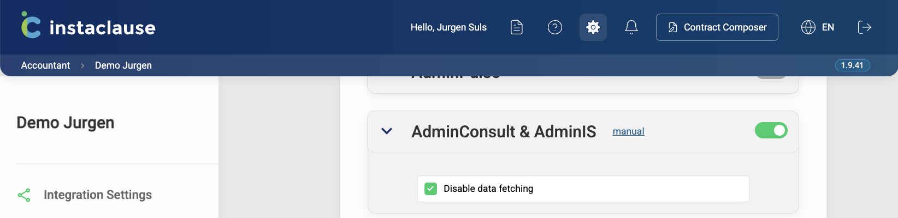

# AdminConsult API — relay AdminConsult data to Instaclause

One of the [two ways into Instaclause](./README.md). This page documents the **`adminconsult`** source.

> ✅ **You are in the right place if** you are forwarding objects that came out of the
> AdminConsult / AdminIS API, unchanged. You post AdminConsult's own response objects and
> Instaclause interprets them.
>
> ↩️ **Pushing data from your own CRM or an in-house system?** That is the other API —
> see the **[Custom API guide](./CUSTOM.md)**. Different payload, different routes,
> different setup.

Base URL: `https://app.instaclause.be/api/v1/adminconsult`

Records posted through this API create customer entities in Instaclause — companies
(BV, CommV, NV, etc.) and persons (shareholders, directors, etc.). These entities are
stored in a separate collection that is **isolated per office**, and they do not mix
with manually added CRM data or with other CRM integrations (HubSpot, Adminpulse,
FID-manager, Tess, Exact Online, etc.) that may be enabled in parallel in the same office.

<p align="center">
  <a href="#-before-you-start--turn-off-the-scheduled-pull">Before you start</a> ·
  <a href="#-getting-your-api-key">API key</a> ·
  <a href="#-authentication">Authentication</a> ·
  <a href="#-routes">Routes</a> ·
  <a href="#-faq">FAQ</a>
</p>

---

<br>

## ⚠️ Before you start — turn off the scheduled pull

Instaclause can also **pull** from AdminConsult on a nightly schedule. That pull writes to
the same records as this API, matched on the same `id` — so if it stays switched on, it
overwrites whatever you push, every night.

```
  UNTICKED — the pull competes with your push:

    AdminConsult ──── nightly pull ─────┐
                                        ├──▶  same records, matched by id
    You ──────────── POST /customers ───┘     ⚠ the pull wins overnight

  TICKED — push-only:

    AdminConsult      (scheduled pull off)
    You ──────────── POST /customers ───────▶  records stay as you pushed them
```

Before pushing anything, the office must tick **Disable data fetching** on the
**AdminConsult & AdminIS** integration under **Integration Settings**.



- The checkbox only appears on the AdminConsult row, and only once the Public API is enabled for the office.
- It switches off the scheduled pull, and hides the AdminConsult credential fields so no connection test or manual import runs.
- It affects the AdminConsult integration only — no other integration changes behaviour.
- It does **not** gate this API. The push routes keep working whether the box is ticked or not; ticking it is what stops the pull from competing with your writes.

---

<br>

## 🔑 Getting your API key

Open the [Instaclause Settings Page](https://app.instaclause.be/accountant/settings) and go
to **Integration Settings**. For an office using AdminConsult, the key sits under its own
**Credentials** heading — there is no Custom APIs involvement.

### What you now have

- **One key for the whole office.** It is not per user and not per integration — the same
  key also authenticates the `custom` source, since the source is only a URL segment.
- **It does not expire.** It stays valid until someone presses Refresh.
- **You can come back for it.** Re-opening the page shows the *same* key, so this is not a
  one-time reveal.
- **It is long** — a few hundred characters. Make sure whatever stores it does not truncate it.

Treat it like a password: keep it in your secret manager, never commit it, never put it in
a URL.

> ⚠️ **Refresh breaks running integrations immediately.** There is no grace period. The
> moment anyone in the office presses **Refresh**, every previously issued key stops working
> and your sync fails until the new key is handed over. That is why the button asks for
> confirmation — and it is the most common cause of a sync that "suddenly broke".

If the key is not under **Credentials**, the office has Custom APIs enabled and it has moved
— see [the README](./README.md#getting-the-key) for all three cases.

---

<br>

## 🛡️ Authentication

Include the API key in the `Authorization` header of every request, as the **raw value** —
no `Bearer` prefix.

```
Authorization: <your API key>
```

A request fails with `401 Unauthorized` if the header is missing, the key is malformed or
not one Instaclause issued, the key has been superseded by a **Refresh**, or the Public API
is switched off for that office.

> ⚠️ **The `adminconsult` segment in the URL is case-sensitive.** Use it in lowercase, exactly as written. A capitalised variant still passes authentication and can return `201 Created` while the data is written nowhere — you would see successful responses and nothing appearing in Instaclause.

---

<br>

## 🛣️ Routes

**Order matters: post the customer before its sub-resources.**

```
  1. POST /customers                                  ← must land first
       │
       ├── 2. POST /customers/{id}/addresses
       └── 3. POST /customers/{id}/customerlinkcustomer
```

`/addresses` and `/customerlinkcustomer` attach to a customer that must already exist. A
sub-route call for a customer that has not been posted yet **still answers `201 Created`,
but stores nothing** — so a `201` on these two routes is not on its own proof that the
write landed. Always create the customer first, then its addresses and links.

### /customers

- Method: POST
- Endpoint: /customers
- Headers:
  - Authorization: [API Key]
- Body: the object for a single customer returned from AdminConsult API /customers
- Response
  - Success Status Code: 201 Created

Forward AdminConsult's own customer object as-is. These are the fields it is read for:

```json
{
  "AccCode": "string",
  "AccountancySoftware": 0,
  "AccountancySoftwareLabel": "string",
  "CommercialName": "string",
  "CompanyId": 0,
  "CreationDate": "string",
  "CupboardNumber": "string",
  "Currency": "string",
  "CustCode": "string",
  "CustKind": "string",
  "CustomerCrmType": 0,
  "CustomerGroup": 0,
  "CustomerGroupLabel": "string",
  "CustomerId": 0,
  "DateOfBirth": "string",
  "DisabledDate": "string",
  "Distance": 0,
  "Email": "string",
  "Fax": "string",
  "Firstname": "string",
  "Holding": 0,
  "Homepage": "string",
  "IsActive": true,
  "IsCompany": true,
  "Language": "string",
  "Mobile": "string",
  "NaceCode": "string",
  "Name": "string",
  "Nationality": "string",
  "Newsletter": true,
  "Phone": "string",
  "Phone2": "string",
  "PlaceOfBirth": "string",
  "ReasonForLeaving": 0,
  "RegistrationNr": "string",
  "Remarks": "string",
  "RPR": "string",
  "Sector": "string",
  "SectorId": 0,
  "Sex": "string",
  "SocialSecurityNumber": "string",
  "Title": "string",
  "VATNr": "string"
}
```

### /customers/{customerId}/addresses

- Method: POST
- Endpoint: /customers/{customerId}/addresses
- Headers:
  - Authorization: [API Key]
- Body: the object returned from AdminConsult API /customers/{customerid}/addresses
- Response
  - Success Status Code: 201 Created
  
### /customers/{customerId}/customerlinkcustomer

- Method: POST
- Endpoint: /customers/{customerId}/customerlinkcustomer
- Headers:
  - Authorization: [API Key]
- Body: the object returned from AdminConsult API /customers/{customerid}/customerlinkcustomer
- Response
  - Success Status Code: 201 Created

---

<br>

## ❓ FAQ

### Does each office get its own API key?
Yes. Each office has its own unique API key, which identifies the office and authenticates the request. This is what keeps offices apart when one application uploads on behalf of several of them.

### Is syncing once a day enough?
Yes.

### Do I re-post everything, or only what changed?
For `/customers`, only the customers that changed. For `/customers/{customerId}/addresses` and `/customers/{customerId}/customerlinkcustomer`, always post the **full list**.

### If I re-post a customer, do I have to re-post its addresses and links too?
Yes. Posting to `/customers` overwrites the customer data, which means all addresses and `customerlinkcustomer` entries must be posted again afterwards.

### Can I delete a customer?
No. There is no DELETE route, so a client pushed once cannot be removed through the API — it stays available in the party picker. Decide up front how your sync should handle clients that leave the office.

### Our sync returns 201 but nothing shows up in Instaclause.
Two known causes: the source segment in the URL was not lowercase `adminconsult`, or addresses / links were posted for a customer that did not exist yet. See the notes under [Authentication](#-authentication) and [Routes](#-routes).
