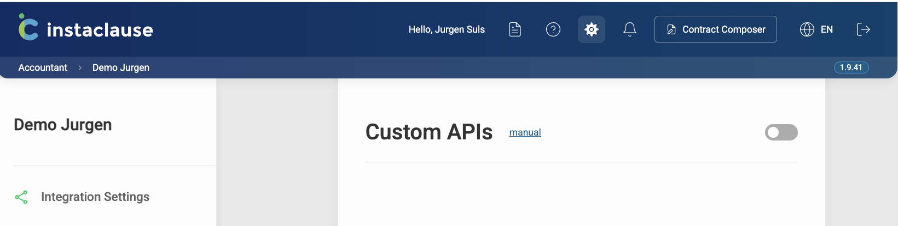
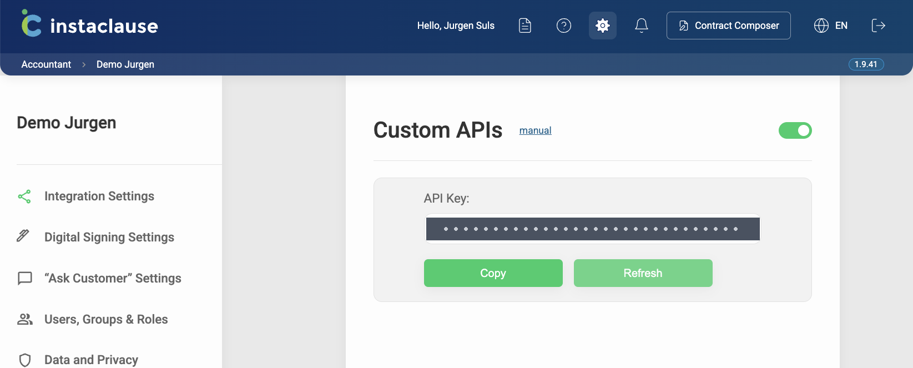

# Custom API — push CRM data to Instaclause

One of the [two ways into Instaclause](./README.md). This page documents the **`custom`** source.

> ✅ **You are in the right place if** your client data comes from your own CRM, an in-house
> system, or any vendor that is not AdminConsult. You will map your records onto
> Instaclause's Party schema and push them here.
>
> ↩️ **Relaying AdminConsult / AdminIS data instead?** That is the other API —
> see the **[main README](./README.md)**. Different payload, different routes, different setup.

Base URL: `https://app.instaclause.be/api/v1/custom`

<p align="center">
  <a href="#-quickstart">Quickstart</a> ·
  <a href="#-getting-your-api-key">API key</a> ·
  <a href="#-authentication">Authentication</a> ·
  <a href="#-routes">Routes</a> ·
  <a href="#-party-schema">Party schema</a> ·
  <a href="#-examples">Examples</a> ·
  <a href="#-limits">Limits</a> ·
  <a href="#-faq">FAQ</a>
</p>

---

<br>

## 🚀 Quickstart

Four steps to your first record. Each one is explained in full further down.

**1. Switch the API on.** In Instaclause, go to **Settings → Integration Settings** and
turn on the **Custom APIs** toggle.

**2. Copy the API key.** It appears in the same block.

**3. Push a record.**

```bash
curl -X POST 'https://app.instaclause.be/api/v1/custom/customers' \
  -H "Authorization: $INSTACLAUSE_API_KEY" \
  -H 'Content-Type: application/json' \
  -d '{"id":"P-1001","type":"person","firstName":"Jan","lastName":"Peeters"}'
```

You get back:

```json
{ "response": "OK", "count": 1 }
```

**4. Check it landed.** Draft a contract, go to the **add party** step and press
**Custom** — `Jan Peeters` is in the list.

That is the whole loop. Everything else in this guide is about the shape of the records
and the rules that apply once you are pushing real data.

---

<br>

## ⚙️ How it works

```
  Your CRM                    Instaclause                     The user
  ────────                    ───────────                     ────────

  ┌──────────┐   POST        ┌──────────────────┐      ┌──────────────────┐
  │  client  │ ────────────▶ │  stored per      │ ───▶ │  "Add party"  →  │
  │  records │  /customers   │  office          │      │  Custom → picker │
  └──────────┘               └──────────────────┘      └──────────────────┘
   you map to                 overwritten by id         normalised into
   the Party schema           isolated per office        contract fields
```

1. **The office enables Custom APIs and copies its API key** from the Instaclause settings page.
2. **Your system pushes client records** to `POST /customers` — one record or an array. Each record needs an `id`.
3. **Instaclause stores them per office**, isolated from manually added parties and from other CRM integrations (HubSpot, AdminPulse, FID-manager, Tess, Exact Online, …) that may run in parallel in the same office.
4. **The user picks them when drafting a contract.** In the **add party** step a **Custom** import button appears, opening a searchable list of the records you pushed. On selection, the record is converted into contract fields.

> **The data format is Instaclause's, not yours.** Records must be shaped like an Instaclause party (`type`, `name`, `companyType`, address fields, `relations`, `shareholders`, …). Mapping your CRM's model onto this schema is the integration work, and it sits on your side. The [Party schema](#-party-schema) below is the contract.

---

<br>

## 🔑 Getting your API key

The Custom API is **off by default**. The office must switch it on before the key appears
and before any request is accepted.

**1.** Open the [Instaclause Settings Page](https://app.instaclause.be/accountant/settings)
and go to **Integration Settings**.

**2.** Switch the **Custom APIs** toggle on.



**3.** The key appears in the same block. Press **Copy**.



### What you now have

- **One key for the whole office.** It is not per user and not per integration — the same
  key also authenticates the `adminconsult` source, since the source is only a URL segment.
- **It does not expire.** It stays valid until someone presses Refresh.
- **You can come back for it.** Re-opening the page shows the *same* key, so this is not a
  one-time reveal.
- **It is long** — a few hundred characters. Make sure whatever stores it does not truncate it.

Treat it like a password: keep it in your secret manager, never commit it, never put it in
a URL.

> ⚠️ **Refresh breaks running integrations immediately.** There is no grace period. The
> moment anyone in the office presses **Refresh**, every previously issued key stops working
> and your sync fails until the new key is handed over. That is why the button asks for
> confirmation — and it is the most common cause of a sync that "suddenly broke".

If an office cannot find the key at all, the display location depends on their setup —
see [the README](./README.md#getting-the-key) for all three cases.

---

<br>

## 🛡️ Authentication

Send the key as the **raw value** of the `Authorization` header — no `Bearer` prefix.

```
Authorization: <your API key>
Content-Type: application/json
```

A request fails with **`401 Unauthorized`** — before anything is written — if:

- the header is missing, or the key is malformed, altered, or not one Instaclause issued;
- the key has been superseded by a **Refresh** on the office's settings page;
- **Custom APIs** is switched off for that office.

If a sync that used to work starts failing wholesale, the last two are almost always the
cause: check the toggle first, then ask the office whether anyone pressed Refresh.

> ⚠️ **The `custom` segment in the URL is case-sensitive.** Use `/api/v1/custom/...` exactly, in lowercase. A capitalised variant is still accepted by authentication and can return `201 Created` while the data goes nowhere — you would see successful responses and an empty picker.

---

<br>

## 🛣️ Routes

### POST /customers

- Method: POST
- Endpoint: `/customers`
- Headers:
  - `Authorization`: [API Key]
  - `Content-Type`: `application/json`
- Body: a single **Party** object **or an array** of Party objects (batch).
- Response
  - Success Status Code: `201 Created`
  - Body: `{ "response": "OK", "count": <number of records> }`

Each record **must** include an `id` (used as the unique identifier; `CustomerId` is also accepted).

> ⚠️ **A re-post is a full replace, not a merge.** The stored record is overwritten wholesale by what you send. If you omit a field you sent last time, it is **erased** — not left in place. Incremental syncs must send each changed record in full, not just the changed fields.

**Validation is all-or-nothing.** If any record in the array is missing an `id`, the entire request fails with `400` and **nothing is written** — you will never get a partial batch. Fix the offending record and re-post the whole chunk.

Large arrays are fine: the server writes them in batches internally, so 500–2000 records per request is a comfortable size.

### GET /customers

- Method: GET
- Endpoint: `/customers?id={id}`
- Headers:
  - `Authorization`: [API Key]
- Response
  - `200 OK` → `{ "response": { ...the stored record... } }`
  - `404 Not Found` if the `id` does not exist.

Use this to verify what actually landed after a push.

> **The returned record does not contain `id`.** The identifier is the document key, and it is stripped from the stored body on write. A naive round-trip diff of "what I sent" vs "what I get back" will therefore always show `id` as missing — exclude it from the comparison.

### There is no DELETE route

Records cannot be removed through the API. A client that leaves the office stays in the party picker indefinitely unless someone removes it another way. If your CRM has a concept of archived or departed clients, decide up front how you want them to appear — a common approach is to stop re-posting them and accept they linger, or to mark them in the `name` so users can see the status in the picker.

---

<br>

## 🧱 Party schema

```
Party  — the top-level record you POST
│
├── type: "person"
│     id (required)
│     firstName, lastName, initials
│     documentNumber, placeOfBirth, dateOfBirth
│     street, number, zipCode, city, businessNumber, email
│
└── type: "company"
      id (required)
      name, companyType, jurisdiction, representedBy, website
      street, number, zipCode, city, businessNumber, email
      │
      ├── relations[]      + function
      └── shareholders[]   + numberOfShares, numberOfVotes
            │
            └── ⚠ children keep ONLY these fields:
                  person  → id, firstName, initials, lastName
                  company → id, name, companyType, representedBy
                Everything else on a child (address, email,
                dateOfBirth, businessNumber) is silently dropped.
```

`type`: `"person"` or `"company"`.

Common fields: `id` (required), `street`, `number`, `zipCode`, `city`, `businessNumber`, `email`.

**Person** also has: `firstName`, `lastName`, `initials` (optional), `documentNumber`, `placeOfBirth`, `dateOfBirth` (format `DD/MM/YYYY`).

**Company** also has: `name`, `companyType`, `jurisdiction`, `representedBy` (optional), `website` (optional), `relations` (optional), `shareholders` (optional).
- `companyType` ∈ `BV, NV, CV, CommV, VOF, VZW, Stichting, SRL, SA, SC, SComm, SNC, ASBL, Fondation, Vereniging`.
- `relations[]` — the company's representatives. Each carries a `function` (e.g. `"Bestuurder"`).
- `shareholders[]` — each carries `numberOfShares` and `numberOfVotes`.

#### Fields that survive on `relations` and `shareholders`

Embedded children are **not** full Party objects. Only these fields are read; everything else you send on a child — address, `email`, `businessNumber`, `dateOfBirth` — is silently dropped.

| Child `type` | Fields kept |
|---|---|
| `person` | `id`, `firstName`, `initials`, `lastName` |
| `company` | `id`, `name`, `companyType`, `representedBy` |

Plus `function` on a relation, and `numberOfShares` / `numberOfVotes` on a shareholder.

If you need the full detail of a representative — their address, email, date of birth — push them as their own top-level record too. The two are independent: the embedded child drives how the company is represented in the contract, the top-level record makes that person selectable as a party in their own right.

#### Referencing instead of embedding

Representatives and shareholders are **embedded** in the company object: the payload is self-contained, so you never need follow-up calls. For the `custom` source there are no sub-routes at all — `POST /customers/{id}/{anything}` returns `400 Bad Request`. (The AdminConsult source does have sub-routes; that difference is the reason this is worth stating.)

Alternatively, if the related person was already pushed as its own record, you may reference it by `id` alone and Instaclause resolves it on selection:

```json
"relations": [{ "id": "P-1001", "function": "Bestuurder" }]
```

Embedding is the more robust option: it does not depend on push ordering.

---

<br>

## 📦 Examples

The **smallest record that works** — everything else is optional:

```json
{ "id": "P-1001", "type": "person", "firstName": "Jan", "lastName": "Peeters" }
```

Populate more than this, though: the picker searches on `name` / `firstName` / `lastName`,
and any field you leave out is a field the user has to type into the contract by hand.

### A person

```json
{
  "id": "P-1001",
  "type": "person",
  "firstName": "Jan",
  "lastName": "Peeters",
  "documentNumber": "90010112345",
  "placeOfBirth": "Gent",
  "dateOfBirth": "12/01/1990",
  "street": "Kerkstraat",
  "number": "10",
  "zipCode": "9000",
  "city": "Gent",
  "businessNumber": "",
  "email": "jan.peeters@example.be"
}
```

### A company, with a representative and a shareholder

```json
{
  "id": "C-2002",
  "type": "company",
  "name": "Acme BV",
  "companyType": "BV",
  "jurisdiction": "Brussel",
  "street": "Main Street",
  "number": "12",
  "zipCode": "1000",
  "city": "Brussel",
  "businessNumber": "0123456789",
  "email": "info@acme.be",
  "website": "https://acme.be",
  "relations": [
    {
      "type": "person",
      "id": "P-1001",
      "firstName": "Jan",
      "lastName": "Peeters",
      "function": "Bestuurder"
    }
  ],
  "shareholders": [
    {
      "type": "person",
      "id": "P-1001",
      "firstName": "Jan",
      "lastName": "Peeters",
      "numberOfShares": "100",
      "numberOfVotes": "100"
    }
  ]
}
```

Note that `Jan Peeters` appears twice here — once as a representative, once as a
shareholder — and that both copies carry only the identifying fields. That is all a child
keeps; see [Fields that survive](#fields-that-survive-on-relations-and-shareholders).

### A batch — several records in one call

Send an array to push many records at once. This is the normal shape for a daily sync.

```json
[
  {
    "id": "P-1001",
    "type": "person",
    "firstName": "Jan",
    "lastName": "Peeters",
    "street": "Kerkstraat", "number": "10", "zipCode": "9000", "city": "Gent",
    "email": "jan.peeters@example.be"
  },
  {
    "id": "C-2002",
    "type": "company",
    "name": "Acme BV",
    "companyType": "NV",
    "street": "Main Street", "number": "12", "zipCode": "1000", "city": "Brussel",
    "businessNumber": "0123456789"
  }
]
```

---

<br>

## ✨ What Instaclause does with the record

You do not need to pre-format for the contract's language or layout. On selection, Instaclause normalises the record:

- **Company type is localised to the contract language** — `BV ↔ SRL`, `NV ↔ SA`, and so on. Push the form you have; the contract renders the right one.
- **Birth dates are reformatted** to the convention of the contract language.
- **Representatives and shareholders are resolved**, either from the embedded objects or by `id` lookup against records you pushed earlier.
- **The picker list is built from a lightweight index** (`type`, `name`, `firstName`, `lastName`, `id`), which keeps it fast on large datasets. Make sure those fields are populated: a record with a blank `name` / `lastName` is hard for the user to find, even though the rest of the record is stored correctly.

---

<br>

## 📏 Limits

- **Request size:** ~10 MB. **Timeout:** 60s.
- For large datasets, send the records in chunks of **500–2000 per request** and repeat the call per chunk. The server writes each request in internal batches, so array size is limited by the request ceiling above rather than by a record count.
- There is no documented rate limit, but a daily sync running chunks sequentially is the intended usage pattern.

---

<br>

## ❓ FAQ

### Does each office get its own API key?
Yes. Each office has its own unique API key, which identifies the office and authenticates the request. Data pushed with one office's key is only ever visible in that office — which is what keeps offices apart when one application uploads on behalf of several of them.

### How often should I sync?
Once a day is sufficient. After the initial upload you can post only the records that changed — but each one must be sent **complete**, since a re-post replaces the stored record rather than merging into it.

### Why did a field disappear after my last sync?
Almost certainly the full-replace behaviour: the record was re-posted without that field, so it was erased. Send the whole record every time.

### I sent an address on a representative and it vanished. Why?
Embedded `relations` and `shareholders` keep only the identifying fields — see [Fields that survive](#fields-that-survive-on-relations-and-shareholders). To carry an address, email or date of birth for that person, push them as their own top-level record as well.

### Do I need to post representatives and shareholders separately?
No. Embed them in the company's `relations` and `shareholders` arrays. The Custom payload is self-contained, so a single `POST /customers` is all you need — unlike the AdminConsult source, which requires separate calls for addresses and links.

### What date format should I use for `dateOfBirth`?
`DD/MM/YYYY` (ISO `YYYY-MM-DD` is also accepted).

### Can I delete a record?
No — [there is no DELETE route](#there-is-no-delete-route). Records can only be replaced by re-posting the same `id`. Plan your handling of departed clients around that.

### The office pressed Refresh and our sync broke. What now?
That is expected — Refresh invalidates every previously issued key immediately. Ask the office to copy the new key from **Settings → Custom APIs** and update it in your configuration.

### Can I get a read-only or per-environment key?
Not currently. One key per office, read + write, no expiry.
